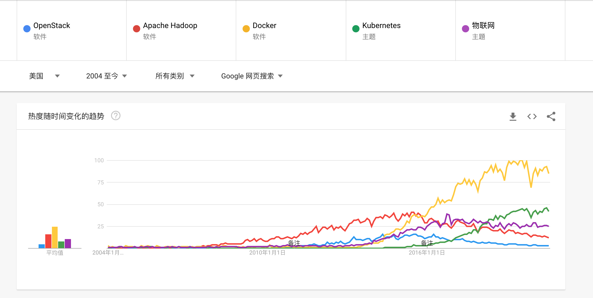
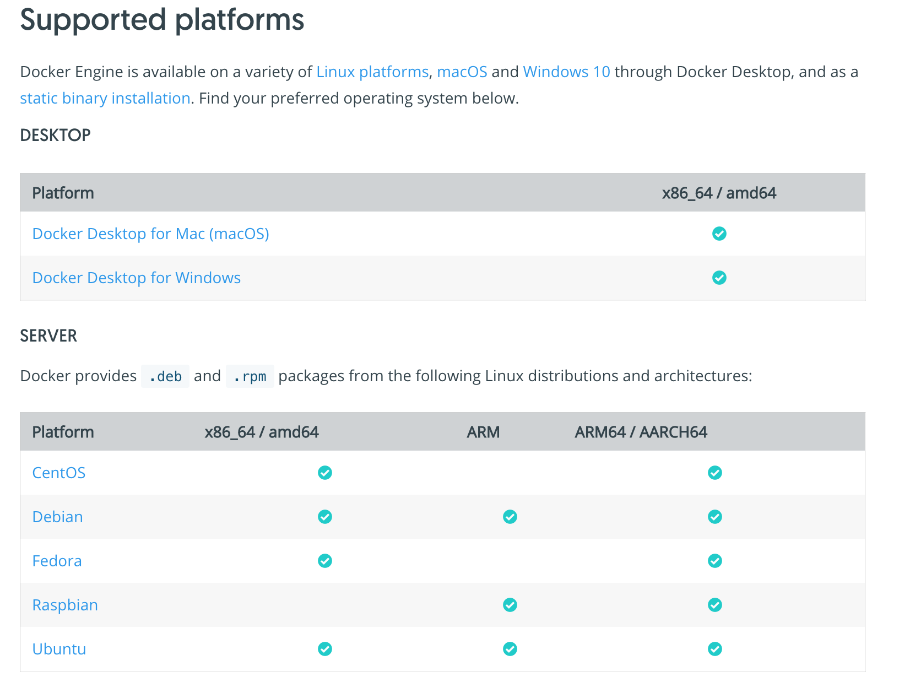

# Docker

## Docker Engine概述 ：
预计阅读时间： 1分钟

Docker Engine是一种开源容器化技术，用于构建和容器化您的应用程序。

Docker Engine通过以下方式充当客户端-服务器应用程序（CS 架构）：
* 具有长时间运行的守护进程的服务器dockerd。
* API，用于指定程序可以用来与Docker守护程序进行对话和指示的接口。
* 命令行界面（CLI）客户端docker。
CLI使用Docker API通过脚本或直接CLI命令控制或与Docker守护程序进行交互。许多其他Docker应用程序都使用基础API和CLI。守护程序创建和管理Docker对象，例如映像，容器，网络和卷。

产品手册 https://docs.docker.com/engine/

## docker搜索热度曲线


### 版本介绍
* 目前docker 分为 社区版和商业版。我们目前常用的社区版。
* 目前最新发行版本为 version 19.03.12,前两位代表年月，最后一位代表补丁版本。
* 版本号与分支对应。

### 发行说明：
现在，可以在单独的发行说明页面上找到当前系列中每个发行版的更改摘要。
https://docs.docker.com/engine/release-notes/

### 安装指南：
* 该安装部分向您展示如何在各种平台上安装docker。
* 桌面系统支持macOS,window10.
* 服务器系统OS支持linux . 我们目前采用了 centos

详细: https://docs.docker.com/engine/install/


## centos7 安装docker,并运行一个简单的web server
### 安装docker yum 源
```
 yum install -y yum-utils device-mapper-persistent-data
 yum-config-manager --add-repo https://download.docker.com/linux/centos/docker-ce.repo
```
### 安装docker 18.09.3
```
yum list docker-ce --showduplicates | sort -r
yum install docker-ce-18.09.3
yum list installed | grep docker
```
### 启动docker 
```
systemctl restart docker
systemctl enable docker
```
### 查看docker 信息及版本
```
[root@docker-build data]# docker version
Client:
 Version:           18.09.3
 API version:       1.39
 Go version:        go1.10.8
 Git commit:        774a1f4
 Built:             Thu Feb 28 06:33:21 2019
 OS/Arch:           linux/amd64
 Experimental:      false

Server: Docker Engine - Community
 Engine:
  Version:          19.03.5
  API version:      1.40 (minimum version 1.12)
  Go version:       go1.12.12
  Git commit:       633a0ea
  Built:            Wed Nov 13 07:24:18 2019
  OS/Arch:          linux/amd64
  Experimental:     false
 containerd:
  Version:          1.2.4
  GitCommit:        e6b3f5632f50dbc4e9cb6288d911bf4f5e95b18e
 runc:
  Version:          1.0.0-rc6+dev
  GitCommit:        6635b4f0c6af3810594d2770f662f34ddc15b40d
 docker-init:
  Version:          0.18.0
  GitCommit:        fec3683
[root@docker-build data]# docker info
Containers: 16
 Running: 16
 Paused: 0
 Stopped: 0
Images: 17436
Server Version: 19.03.5
Storage Driver: overlay2
 Backing Filesystem: xfs
 Supports d_type: true
 Native Overlay Diff: true
Logging Driver: json-file
Cgroup Driver: cgroupfs
Plugins:
 Volume: local
 Network: bridge host ipvlan macvlan null overlay
 Log: awslogs fluentd gcplogs gelf journald json-file local logentries splunk syslog
Swarm: inactive
Runtimes: runc
Default Runtime: runc
Init Binary: docker-init
containerd version: e6b3f5632f50dbc4e9cb6288d911bf4f5e95b18e
runc version: 6635b4f0c6af3810594d2770f662f34ddc15b40d
init version: fec3683
Security Options:
 seccomp
  Profile: default
Kernel Version: 3.10.0-862.el7.x86_64
Operating System: CentOS Linux 7 (Core)
OSType: linux
Architecture: x86_64
CPUs: 12
Total Memory: 31.31GiB
Name: docker-build
ID: FBJ4:ZHK2:CK4S:KUOI:AFFM:OZ7B:HTZI:3PMN:EMBR:FEKH:CCEK:4CLG
Docker Root Dir: /data/docker-dir
Debug Mode (client): false
Debug Mode (server): false
Registry: https://index.docker.io/v1/
Labels:
Experimental: false
Insecure Registries:
 127.0.0.0/8
Registry Mirrors:
 https://kfq51tpx.mirror.aliyuncs.com/
Live Restore Enabled: false
```

###   配置修改docker服务
##### 创建修改配置文件
```
sudo mkdir -p /etc/docker
sudo tee /etc/docker/daemon.json <<-'EOF'
{ "registry-mirrors": ["https://i3khnsz8.mirror.aliyuncs.com"],
"exec-opts": ["native.cgroupdriver=systemd"],
"data-root": "/data/docker" }
EOF

sudo systemctl daemon-reload 
sudo systemctl restart docker
```

### 运行第一个容器
##### 启动一个容器
```
[root@localhost data]# docker run  -d -p 8001:80 nginx
Unable to find image 'nginx:latest' locally
latest: Pulling from library/nginx
bf5952930446: Pull complete
cb9a6de05e5a: Pull complete
9513ea0afb93: Pull complete
b49ea07d2e93: Pull complete
a5e4a503d449: Pull complete
Digest: sha256:b0ad43f7ee5edbc0effbc14645ae7055e21bc1973aee5150745632a24a752661
Status: Downloaded newer image for nginx:latest
ddd422865238ceedd1928542721af6314f5f0763183f4de527b4b038fe1b93b0
```
##### 访问容器
```
[root@localhost data]# curl 127.0.0.1:8001
<!DOCTYPE html>
<html>
<head>
<title>Welcome to nginx!</title>
<style>
    body {
        width: 35em;
        margin: 0 auto;
        font-family: Tahoma, Verdana, Arial, sans-serif;
    }
</style>
</head>
<body>
<h1>Welcome to nginx!</h1>
<p>If you see this page, the nginx web server is successfully installed and
working. Further configuration is required.</p>

<p>For online documentation and support please refer to
<a href="http://nginx.org/">nginx.org</a>.<br/>
Commercial support is available at
<a href="http://nginx.com/">nginx.com</a>.</p>

<p><em>Thank you for using nginx.</em></p>
</body>
</html>


```

#### 参考：
Docker官网： https://docs.docker.com/


